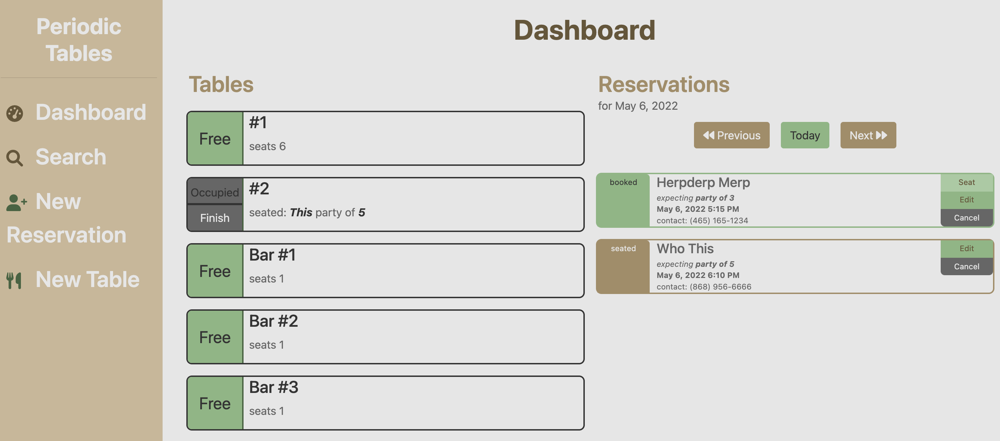
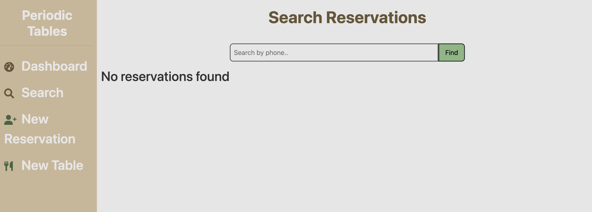
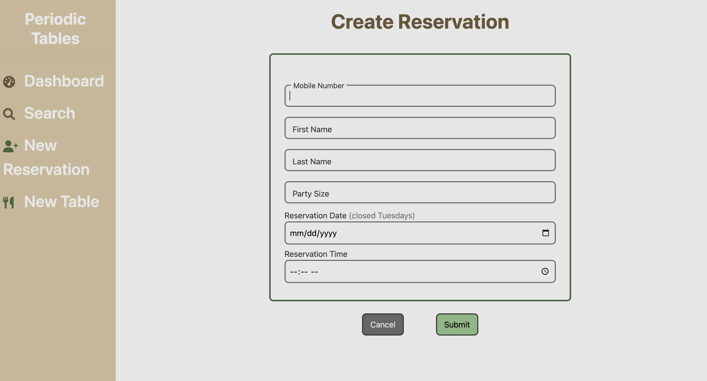

# Dinner Reservation

Live app: https://thefonso-cafe.onrender.com/dashboard

## Description

A restaurant reservation system that allows restaurant staff to:
- reservations:
	- create reservations
	- edit reservations
	- cancel reservations
	- seat reservations at a table
	- search reservations by phone number
- tables:
	- create a new table
	- seat a table with a reservation
	- finish seated reservations


## API 

API base url: ???

| **API Path** | **Method(s)**|
|-------:|:--------|
| `/reservations`	|`GET`: List all reservations|
| `/reservations`	|`POST`: Create a new reservation.|
| `/reservations/?date='YYYY-MM-DD'`	|`GET`: List all reservations by date.|
| `/reservations/?mobile_number='###'`	|`GET`: List all reservations by ```mobile_number``` with a partial match.|
| `/reservations/:reservation_id`	|`GET`: Read a single reservation by ```reservation_id```.|
| `/reservations/:reservation_id`	|`PUT`: Update a reservation by ```reservation_id```.|
| `/reservations/:reservation_id/status`	|`PUT`: Update a reservation's status. Options being "booked", "seated", "cancelled", or "finished".|
| `/tables`	|`GET`: List all tables.|
| `/tables`	|`POST`: Create a new table.|
| `/tables/:table_id/seat`	|`PUT`: Update a table's status to "occupied" via adding ```reservation_id```.|
| `/tables/:table_id/seat`	|`DELETE`: Update a table's status to "free" via removing ```reservation_id```.|

<br>
<br>
<br>
<hr>

## Tech Stack

#### Front-end

CSS
HTML
JavaSccript
React

#### Back-end

JavaScript
Node.js
Express
Knex


## Screenshots

__/dashboard__

<br>

__/search__

<br>

__/reservations/new__

<br>


<br>
<br>
<br>

## Installation

1. Fork and clone this repository.
1. Run `cp ./back-end/.env.sample ./back-end/.env`.
1. Update the `./back-end/.env` file with the connection URL's to your PostgreSQL database instance.
1. Run `cp ./front-end/.env.sample ./front-end/.env`.
1. You should not need to make changes to the `./front-end/.env` file unless you want to connect to a backend at a location other than `http://localhost:5000`.
1. Run `npm install` to install project dependencies.
1. Run `npm run start:dev` to start your server in development mode.

